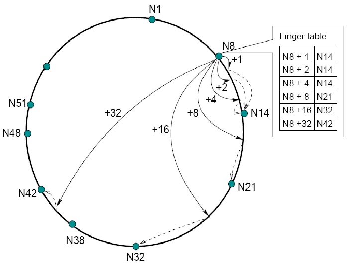

# Suzuki-Kasami implementation overview

This project is an implementation of the Suzuki-Kasami token based distributed systems algorithm.<br>
The algorithm is most simply explained on the following linkg:<br><br>
https://www.geeksforgeeks.org/suzuki-kasami-algorithm-for-mutual-exclusion-in-distributed-system/
<br><br>
The base is a chord system which is holding servents (server and client at the same time) which<br>
work with textual files. Suzuki-Kasami ensures only one added servent is adding another servent at a time<br>
and that it doesn't interfere with file adding. System also implement a fail recovery system<br>
which in ideal situations should make the system readjust after a servent has died. For more information<br>
a documentation file "RafBook dokumentacija.pdf" in serbian is provided.

## Bootstrap server

The bootstrap server is a simple server with the sole purpose of giving the new servent another<br>
already in the system present servent which will add the it. Bootstrap server doesn't know anything<br>
of the architecture in the system.<br>

## Chord system

The idea of the chord system is that considering we're on a distributed system and want to be using<br>
some sort of DHT(distributed hash table), we can implement a algorithm that would be faster by<br>
searching for nodes(or servents) on which to store the data in log dependent time instead of linear<br>
dependernt time.<br>


Looking at the picture we can see that we can have a node which could keep track of its successors that<br>
are 2^n away from it. Each node keeps track of its successors by a successors table which has to be updated<br>
each time a new node is present in the system. This adding of nodes and successor table update needs to take<br>
place synchronously. This is where the Suzuki-Kasami algorithm comes into place.<br>





Each node can add another node only if it holds the token, so each time a node wants to add another node it<br>
requests the token, waits for it and when it receives it, all the actions mentioned above take place.<br>
Then it can give away the token to the next node waiting for it. How does it know which node to pick?<br>
You can check that out on the link provided for the Suzuki-Kasami algorithm.

## File adding

Files are added based on the chord system, that is in the current configuration of the system which can be found in the<br>
chord/servent_list.properties file we have a chord size of 64. This means there can be a maximum o 64 summary of files and nodes.<br>
Nodes will add files in log time based on their name. For simplicity every file is given a chord number (0-63), so the user<br>
should keep an eye that the number doesn't collide with a node. <br>

## Config

A sample of the servent_list.properties file would be:<br>

```
root=D:\\Java (Programming)\\IntelliJprojects\\RAFBook\\root
ip=localhost
weak_limit=4000
strong_limit=10000
servent_count=5
chord_size=64
bs.port=2000
servent0.port=1100
servent1.port=1200
#use the next one to test collisions - it will clash with 1100
#servent1.port=1164
servent2.port=1300
servent3.port=1400
servent4.port=1600
```

Where root is the folder in which files will be held, ip is ip where the communication will take place<br>
(hardcoded localhost, needs code change to work on other networks), weak and strong limits are for<br>
how long a servent should be waited to pong for failure detection, servent_count is the number of servents<br>
chord_size is the size of the chord system, bs.port is the bootstraps server port and the rest are servent ports.<br>
A sample of a servent config is:<br>

```
pause 10000
add_file 46.txt private
pause 20000
get_file 25.txt
pause 6000
remove_file 46.txt
pause 5000000
```

For detailed specification of the commands refer to the documentation provided in "RafBook dokumentacija.pdf",<br>
it's in serbian though.<br>

## Failure detection

If a node was to fail, it's successor should notice this. Every servents gets pinged by its successor every 5s.<br>
If the pong fails to reach the successor it contacts the suspicious servents predecessor, if it can't reach the<br>
suspicious servent it is marked for removal and the system starts reconfiguring. The failure recovery isn't fully<br>
operational as it doesn't work in some cases and one of those is two neighbor servents die at the same time.<br>
